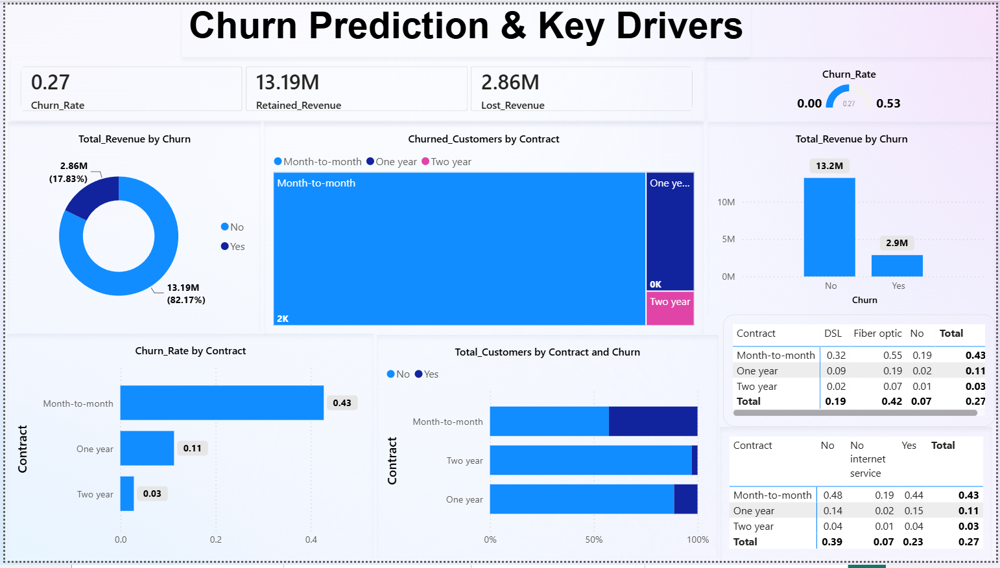
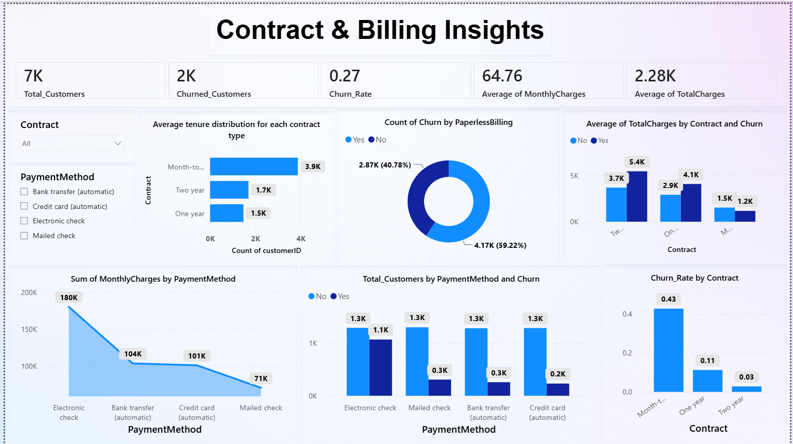
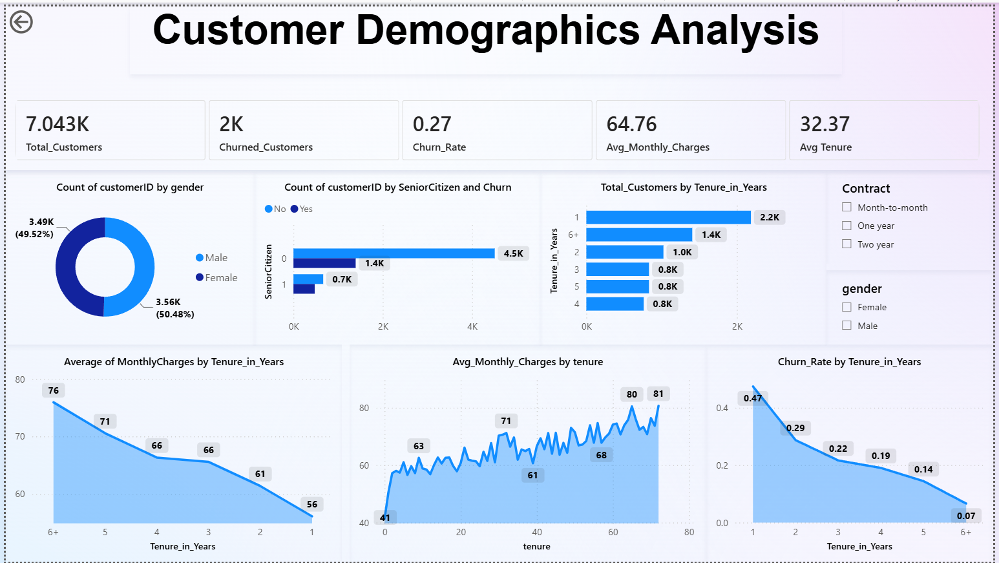
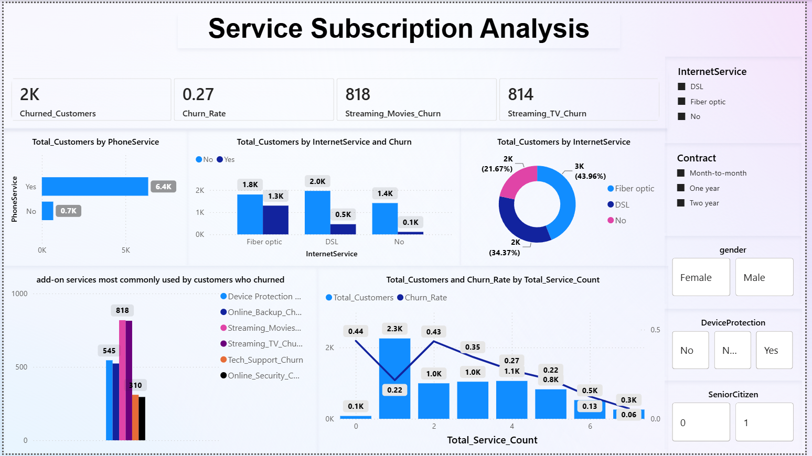

# 📊 Customer Churn Analysis Dashboard (Power BI)


## 📖 Overview

The **Customer Churn Analysis Dashboard** is an interactive Business Intelligence project developed using **Microsoft Power BI**. The dashboard analyzes customer behavior, identifies factors contributing to churn, and provides actionable insights to improve customer retention and business performance.

The project focuses on analyzing customer demographics, contract types, billing behavior, service subscriptions, and revenue impact to help businesses understand why customers leave and how churn can be minimized.

---

# 🎯 Objectives

- Analyze customer churn patterns.
- Identify key drivers behind customer attrition.
- Monitor retained and lost revenue.
- Understand the impact of contracts and billing methods.
- Analyze customer demographics.
- Evaluate service subscription behavior.
- Enable interactive business reporting through filters and drill-down analysis.

---

# 🛠️ Tools & Technologies

- Microsoft Power BI
- Power Query
- DAX (Data Analysis Expressions)
- Data Modeling
- Data Visualization
- Interactive Dashboards

---

# 📂 Dashboard Pages

## 1️⃣ Churn Prediction & Key Drivers

### KPIs

- Churn Rate
- Retained Revenue
- Lost Revenue

### Visualizations

- Revenue by Churn Status
- Churned Customers by Contract
- Revenue Distribution
- Churn Rate by Contract
- Customer Distribution by Contract
- Internet Service vs Contract Matrix
- Internet Service Availability Matrix

### Key Insights

- Overall churn rate is **27%**.
- More than **₹13.19 Million** revenue has been retained.
- Approximately **₹2.86 Million** revenue has been lost due to churn.
- Month-to-Month customers contribute the highest churn.
- Two-Year contracts show the lowest churn.

---

## 2️⃣ Contract & Billing Insights

### KPIs

- Total Customers
- Churned Customers
- Churn Rate
- Average Monthly Charges
- Average Total Charges

### Visualizations

- Average Tenure by Contract
- Paperless Billing Analysis
- Total Charges by Contract
- Monthly Charges by Payment Method
- Customer Distribution by Payment Method
- Churn Rate by Contract

### Filters

- Contract Type
- Payment Method

### Key Insights

- Electronic Check customers have the highest churn.
- Paperless billing users are more likely to churn.
- Longer contracts significantly improve retention.
- Customers with higher total charges generally stay longer.

---

## 3️⃣ Customer Demographics Analysis

### KPIs

- Total Customers
- Churned Customers
- Churn Rate
- Average Monthly Charges
- Average Tenure

### Visualizations

- Gender Distribution
- Senior Citizen Analysis
- Customer Distribution by Tenure
- Monthly Charges by Tenure
- Churn Rate by Tenure

### Filters

- Contract Type
- Gender

### Key Insights

- Gender distribution is nearly balanced.
- Senior citizens exhibit relatively higher churn.
- Short-tenure customers are more likely to leave.
- Churn steadily decreases as customer tenure increases.

---

## 4️⃣ Service Subscription Analysis

### KPIs

- Churned Customers
- Churn Rate
- Streaming Movies Churn
- Streaming TV Churn

### Visualizations

- Phone Service Distribution
- Internet Service vs Churn
- Internet Service Distribution
- Add-on Services Used by Churned Customers
- Service Count vs Churn Rate

### Filters

- Internet Service
- Contract
- Gender
- Device Protection
- Senior Citizen

### Key Insights

- Fiber Optic customers have higher churn than DSL customers.
- Customers with fewer subscribed services are more likely to churn.
- Streaming services are common among churned customers.
- Customers with multiple subscribed services have better retention.

---

# 📊 Dataset Information

| Attribute | Details |
|-----------|---------|
| Dataset | Customer Churn Dataset |
| Records | 7,043 Customers |
| Target Variable | Churn |
| Features | Gender, Senior Citizen, Contract, Tenure, Payment Method, Internet Service, Monthly Charges, Total Charges, Multiple Service Features |

---

# 📈 Business Insights

- Overall Customer Churn Rate: **27%**
- Lost Revenue: **₹2.86 Million**
- Retained Revenue: **₹13.19 Million**
- Month-to-Month contracts have the highest churn.
- Two-Year contracts have the best customer retention.
- Fiber Optic customers churn more frequently than DSL customers.
- Electronic Check is the payment method with the highest churn.
- Customers with longer tenure show significantly better retention.

---

# 📊 DAX Measures

Some of the important DAX measures used include:

- Total Customers
- Churned Customers
- Churn Rate
- Retained Revenue
- Lost Revenue
- Average Monthly Charges
- Average Total Charges
- Customer Count
- Revenue by Churn Status

---

# 📁 Project Structure

```text
Customer-Churn-PowerBI/
│
├── Customer_Churn.pbix
├── Dataset/
│   └── customer_churn.csv
│
├── Images/
│   ├── Churn_prediction_&_Key_Drivers.png
│   ├── Contract_&_Billing.png
│   ├── Customer_Demographics.png
│   └── Service_subcriptions.png
│
├── README.md
└── LICENSE
```

---

# 📷 Dashboard Preview

## Churn Prediction & Key Drivers



---

## Contract & Billing Insights



---

## Customer Demographics Analysis



---

## Service Subscription Analysis



---

# 🚀 Future Improvements

- Machine Learning-based Churn Prediction
- Customer Segmentation using Clustering
- Power BI Service Scheduled Refresh
- Executive Dashboard
- Mobile Optimized Dashboard
- Real-Time Data Integration

---

# 💼 Skills Demonstrated

- Power BI
- DAX
- Power Query
- Data Cleaning
- Data Modeling
- Dashboard Design
- KPI Development
- Customer Analytics
- Revenue Analysis
- Business Intelligence
- Interactive Reporting
- Data Storytelling

---

# 👨‍💻 Author

**Bhargav Praveen**

**Data Analyst | Power BI Developer | Data Science Enthusiast**

---

## ⭐ If you found this project useful, consider giving it a Star on GitHub!
